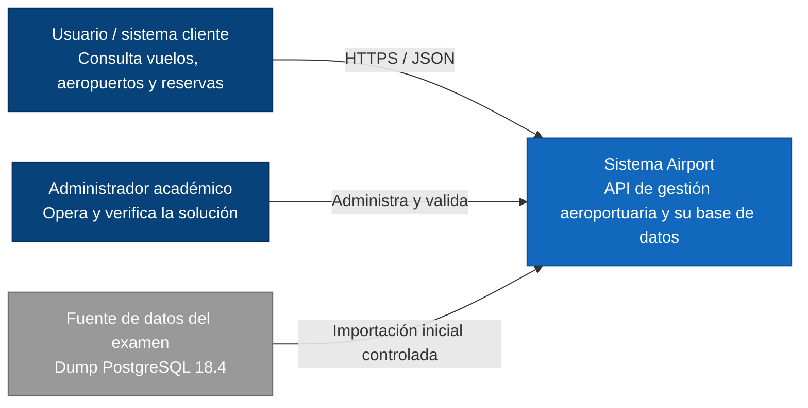
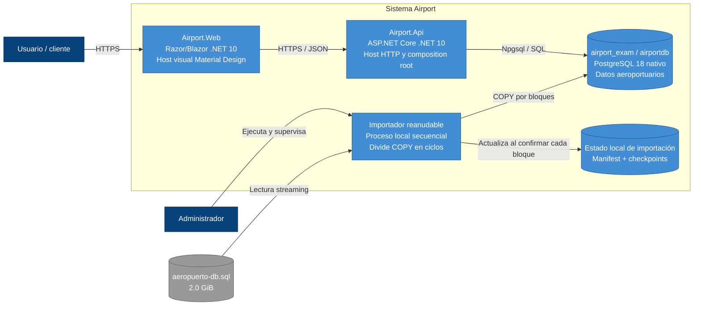
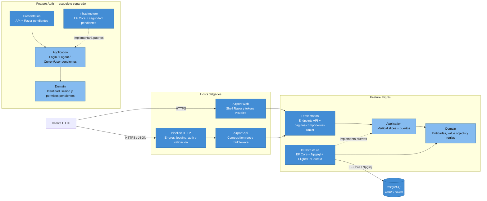
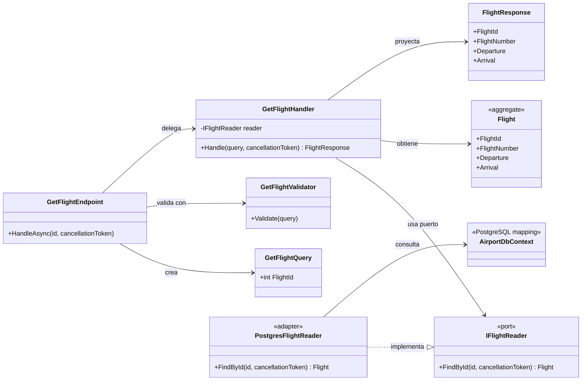
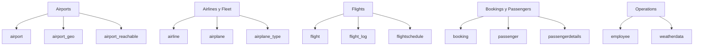

# Diagramas C4 — Airport

Estos diagramas describen la arquitectura objetivo. El proyecto todavía no ha sido
generado y algunos nombres podrán ajustarse a los endpoints definitivos del examen.

## Nivel 1 — Contexto del sistema

## Nivel 2 — Contenedores

## Nivel 3 — Componentes de Airport.Api

La flecha punteada representa inversión de dependencia: Infrastructure implementa
los puertos de Application; Domain y Application no conocen EF Core ni Npgsql.

## Nivel 4 — Código de un vertical slice de ejemplo

El mismo patrón se repetirá dentro de cada feature. Una operación de escritura puede
añadir un puerto `IUnitOfWork` y reglas del agregado, pero no introducirá una capa
global de servicios que mezcle casos de uso.
## Mapa de features hacia las tablas existentes

