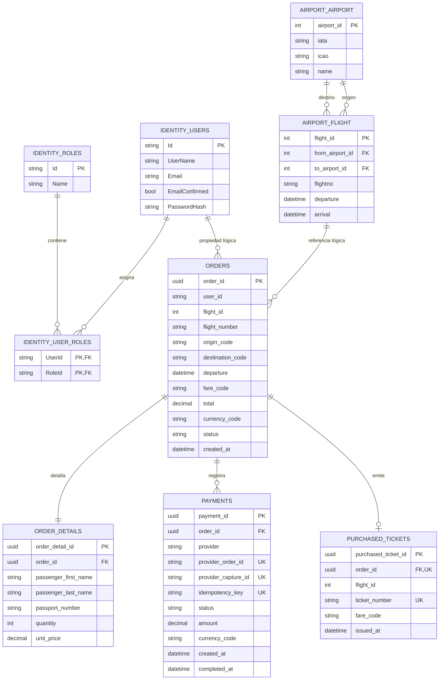
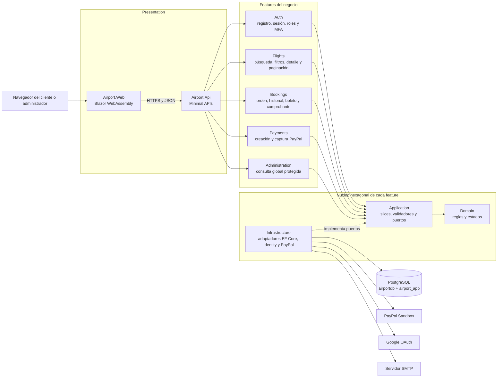
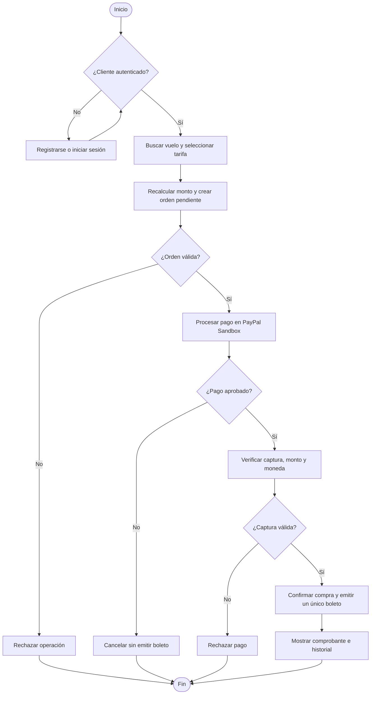
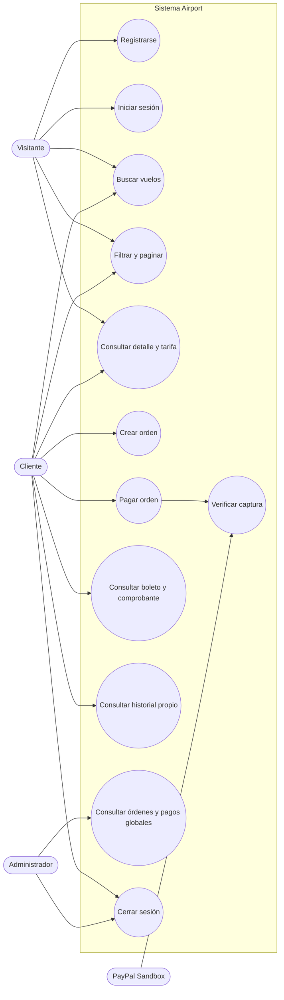
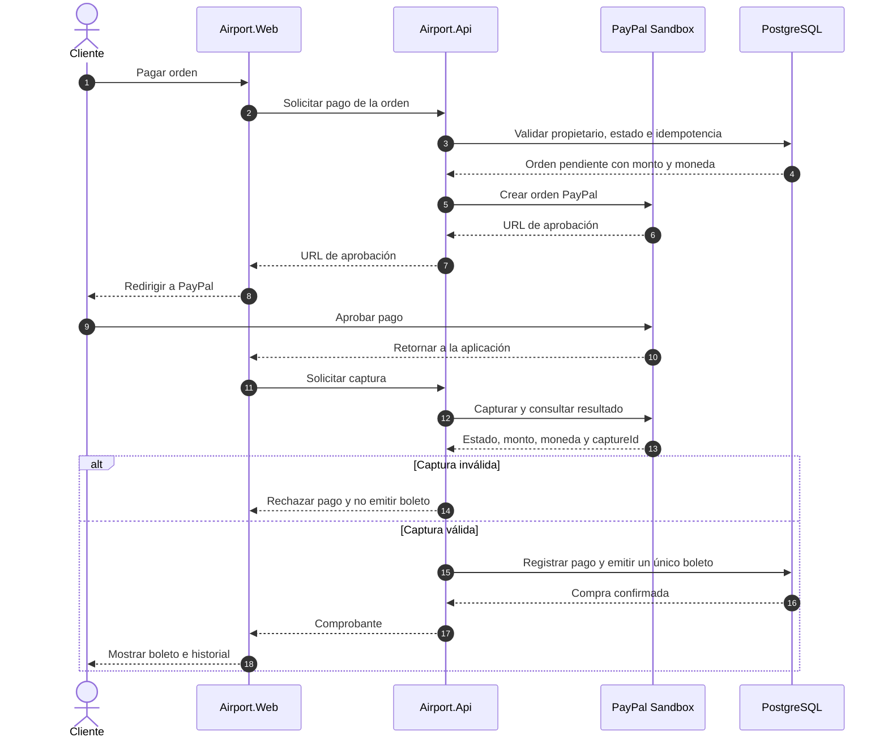
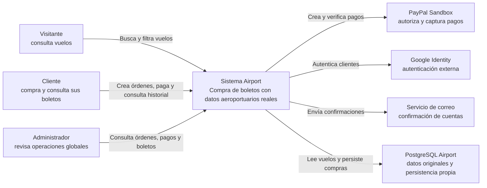
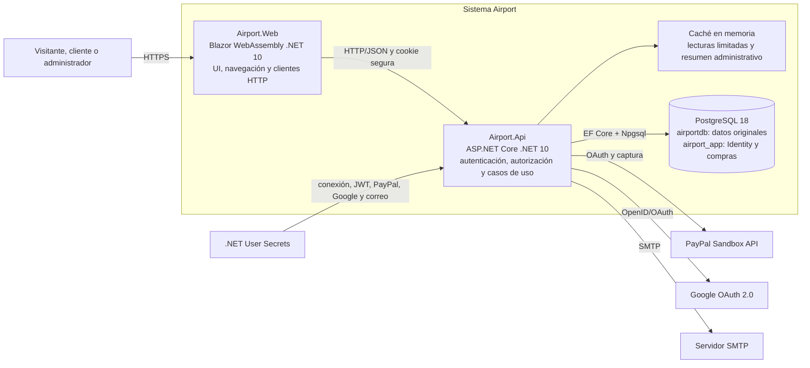
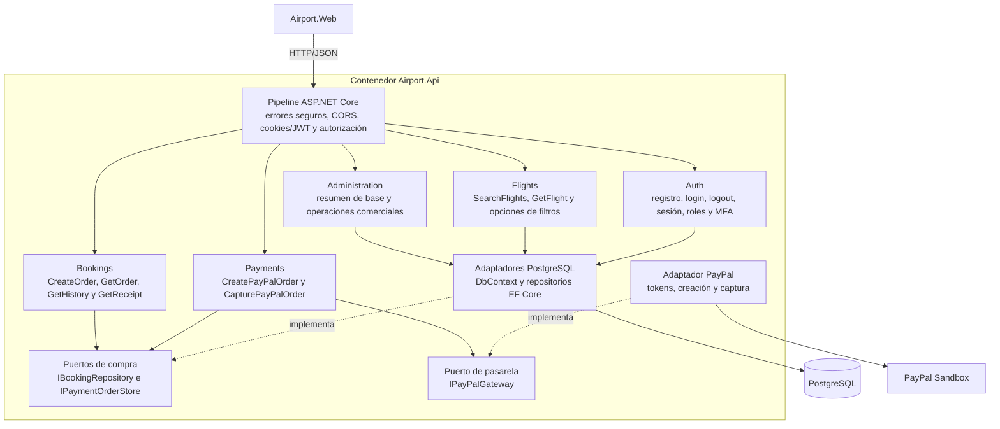
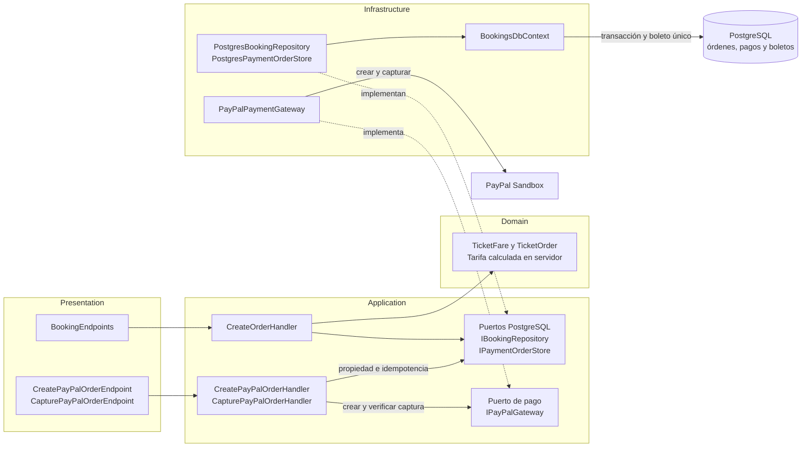

# Diagramas del sistema Airport — Tipo 1: Compra de boletos

Este documento presenta las vistas estructurales y de comportamiento del sistema implementado. La
numeración continúa la secuencia del informe técnico. El mayor nivel de detalle se concentra en la
compra y el procesamiento de pagos porque la integración funcional con la pasarela representa el
criterio de mayor ponderación de la rúbrica: 5 puntos. También se hacen visibles la autorización,
el aislamiento por usuario, el cálculo de tarifas en el servidor, la idempotencia y la emisión única
del boleto.

## 4. Diagrama de entidad-relación de la base de datos

Las tablas originales se conservan en `airportdb`. Las tablas creadas para el ejercicio y las de
ASP.NET Core Identity se aíslan en `airport_app`. Las relaciones marcadas como lógicas se validan
desde la aplicación; no representan claves foráneas físicas entre contextos.

## 5. Diagrama de arquitectura

La solución combina arquitectura hexagonal, vertical slices y screaming architecture. Cada feature
expone casos de uso desde Application, mantiene reglas puras en Domain y accede a servicios externos
mediante puertos implementados por Infrastructure.

## 6. Diagrama de flujo del proceso de compra

## 7. Diagrama de casos de uso

## 8. Diagrama de secuencia del pago

Este flujo destaca la integración de mayor valor en la rúbrica: el navegador no confirma pagos ni
define importes; el backend recupera la orden del usuario, crea la solicitud, verifica la captura y
persiste el resultado de forma idempotente.

## 9. Diagrama C4 de Contexto

## 10. Diagrama C4 de Contenedores

## 11. Diagrama C4 de Componentes

## 12. Diagrama C4 de Código del Módulo de Compra de Boletos y Procesamiento de Pagos

Esta vista recibe prioridad porque reúne las reglas con mayor impacto en la evaluación: usuario
autenticado, propiedad de la orden, precio autoritativo, pago Sandbox real, verificación desde el
backend, idempotencia, transacción y emisión única del boleto.

### Trazabilidad de los criterios prioritarios

| Criterio evaluado | Evidencia en los diagramas |
|---|---|
| PayPal Sandbox funcional y verificado por el backend | 6, 8, 10, 11 y 12 |
| Identity, sesiones, roles y autorización | 5, 7, 9, 10 y 11 |
| Flujo completo de compra | 4, 6, 7, 8 y 12 |
| LINQ, filtros y paginación física | 5, 6 y 11 |
| EF Core, relaciones y migraciones propias | 4, 5, 10 y 12 |
| Idempotencia, aislamiento y emisión única | 4, 6, 8 y 12 |
