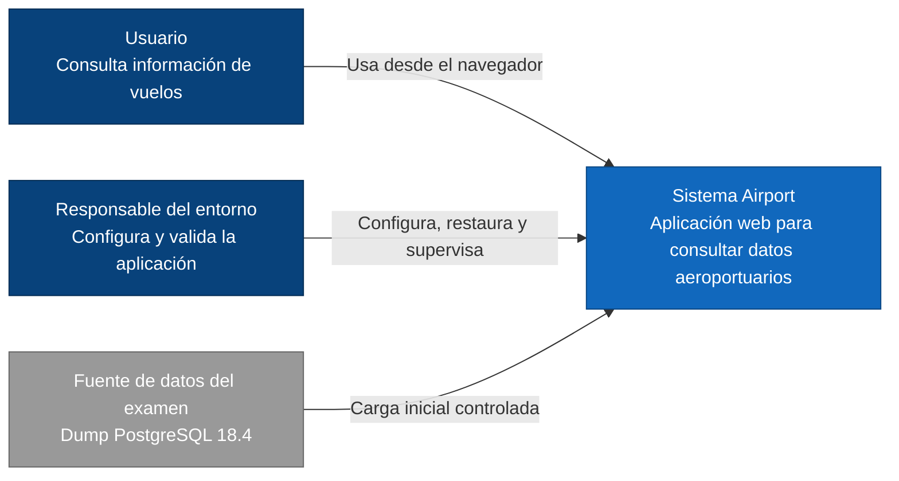
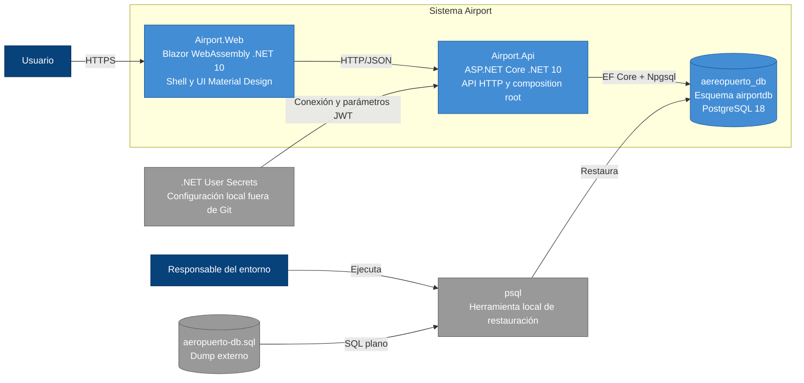
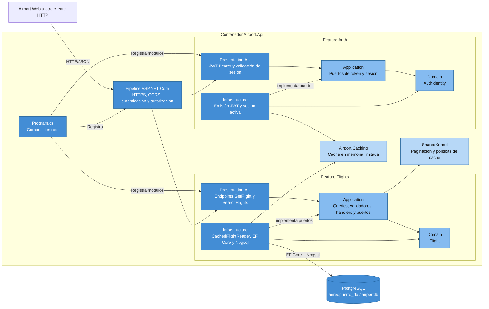
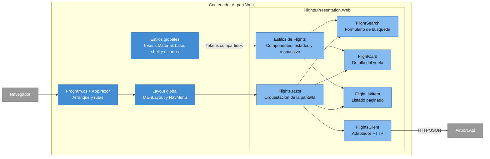
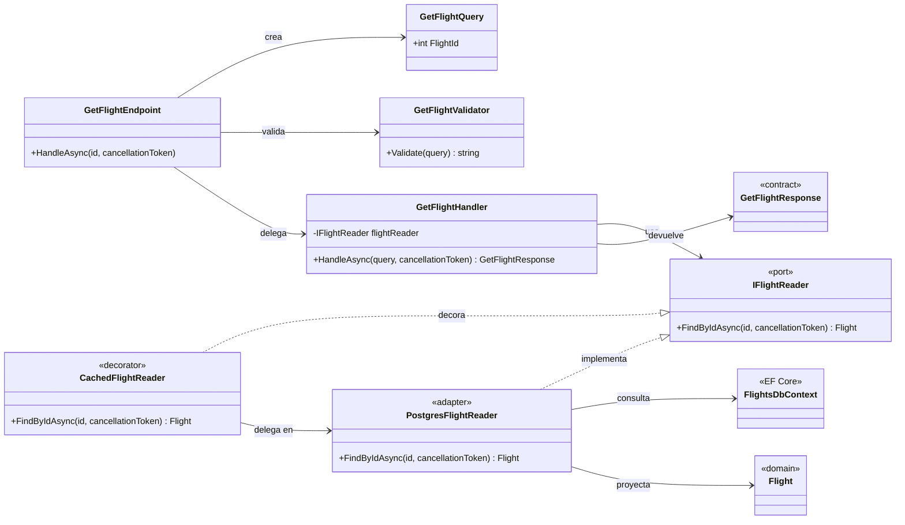
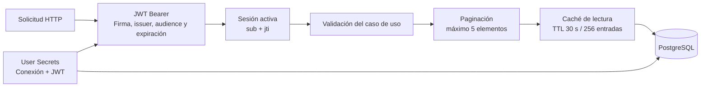
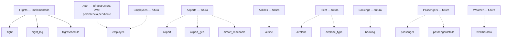

# Diagramas C4 — Airport

Este documento describe la arquitectura implementada actualmente. Los diagramas usan
la jerarquía C4 como guía y añaden vistas de apoyo cuando una relación no pertenece
estrictamente a un nivel C4.

## Criterio de documentación

En un proyecto profesional no se crean automáticamente los cuatro niveles C4 para
cada módulo. Se mantiene una sola vista de contexto del sistema y una vista de
contenedores; después se agregan diagramas de componentes sólo para los contenedores
o módulos cuya estructura necesite explicación. El nivel de código se reserva para
flujos críticos o patrones de referencia.

En Airport se documentan los hosts completos y se usa Flights como vertical slice de
referencia. Las features futuras deben seguir el mismo patrón sin duplicar diagramas
hasta que introduzcan una decisión arquitectónica distinta.

## Nivel 1 — Contexto del sistema

## Nivel 2 — Contenedores

La restauración con `psql` prepara la base, pero no forma parte del runtime. La
aplicación accede a PostgreSQL exclusivamente mediante EF Core y Npgsql.

## Nivel 3A — Componentes de Airport.Api

Las flechas punteadas representan inversión de dependencias: Infrastructure
implementa puertos definidos por Application. Domain y Application no conocen EF
Core, Npgsql ni ASP.NET Core.

Auth configura emisión y validación JWT, vida de 15 minutos, clock skew de 30
segundos y una sesión activa por usuario mediante `sub` y `jti`. Los slices de
Login, Logout y CurrentUser todavía no están implementados.

## Nivel 3B — Componentes de Airport.Web

El host Web sólo conserva el arranque, el shell y los estilos transversales. La
página, los componentes, el cliente HTTP y los estilos específicos viven dentro de
`Flights/Presentation/Web`.

## Nivel 4 — Código del slice GetFlight

Este slice sirve como patrón para operaciones futuras: Presentation valida y delega,
Application coordina mediante puertos, Infrastructure implementa adaptadores y Domain
permanece libre de frameworks.

## Vista de apoyo — Políticas transversales

User Secrets se usa sólo para desarrollo local y no se versiona. Caché, paginación,
CORS y demás límites operativos son políticas o configuración, no secretos.

## Vista de apoyo — Features y propiedad de tablas

Las líneas continuas representan responsabilidad implementada; las discontinuas,
responsabilidad planificada. Una relación SQL no autoriza a una feature a acceder a
los detalles internos de otra.
